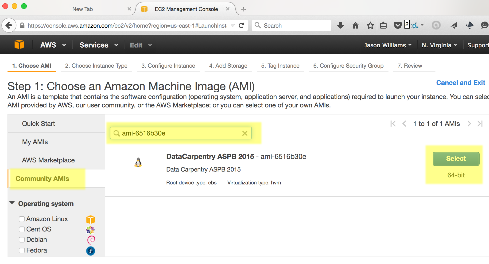
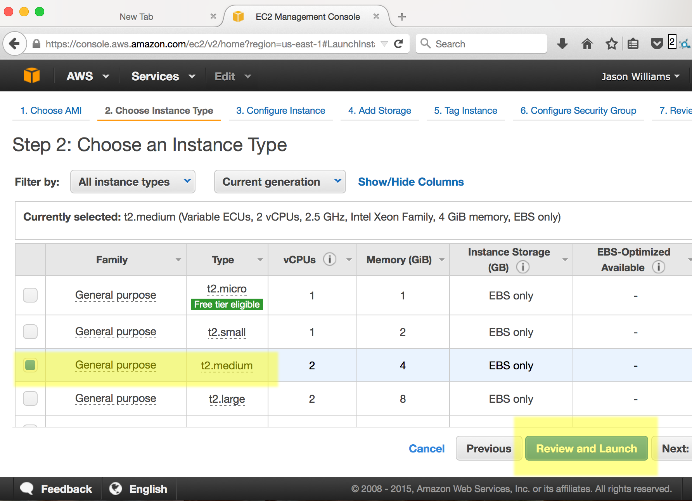
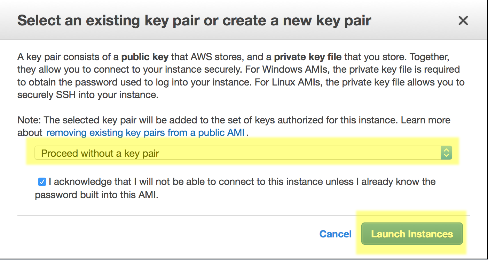
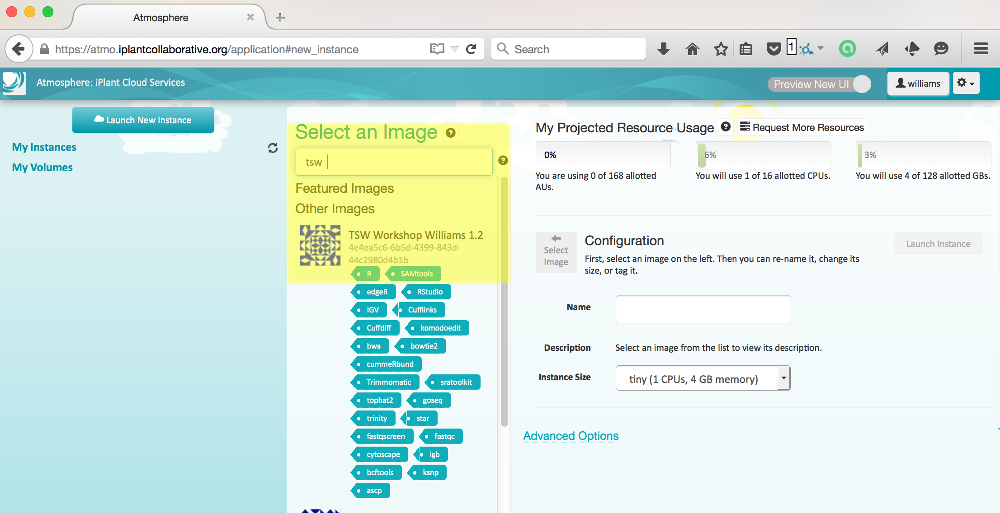
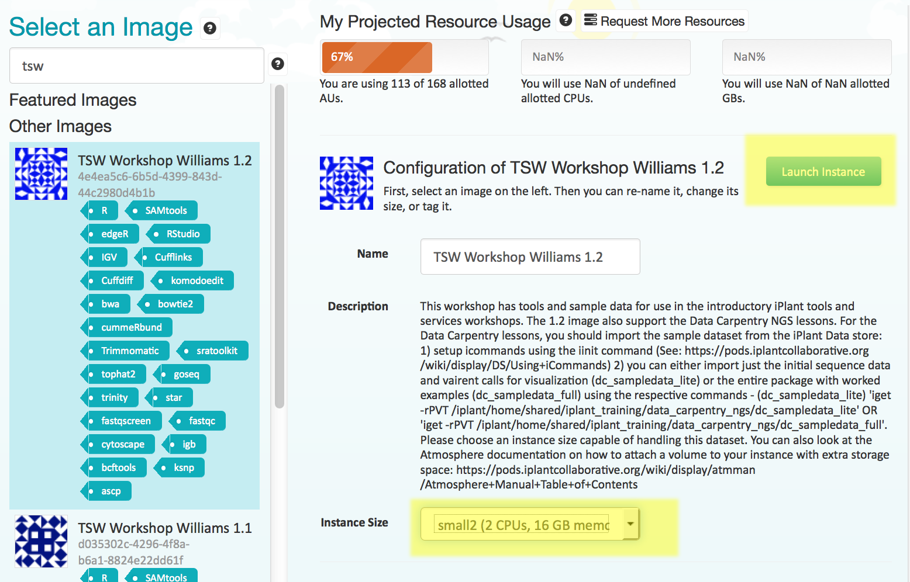
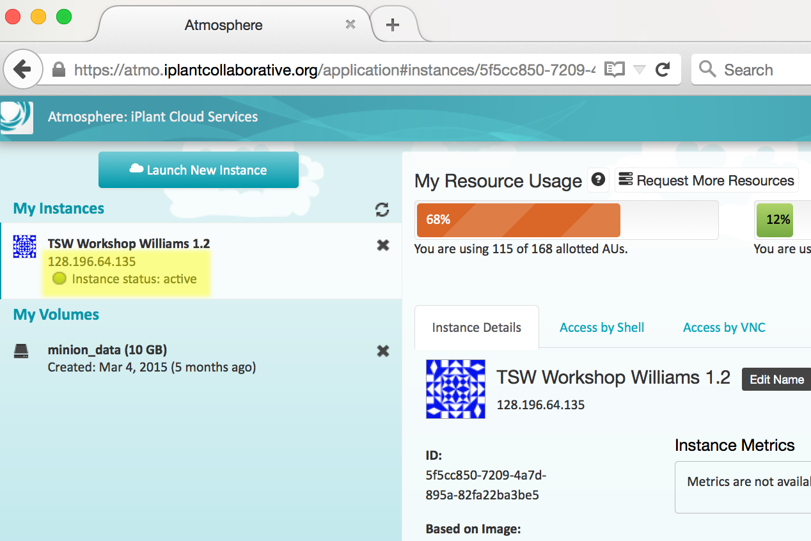

## Launching and logging onto a cloud instance


# Learning Objectives:

* Describe the advantages and disadvantages of various cloud computing platforms.
* Transfer data into a cloud session using iCommands.
* Terminate a cloud session.

**Important Caveat**: For many of the above steps, your instructor will have completed these tasks for you. If you are learning on your own, or trying this after the workshop, see the exercises and instructions below. 

### Choosing a cloud platform

The most important thing about *The Cloud* is choice - instead of purchasing a physical computer, you can obtain on-demand computing at almost any scale. This power comes with advantages and disadvantages:

**Advantages of Cloud Computing**
* Access large amounts of computing power on demand
* Full administrative rights - install anything
* Use pre-configured images (software already installed)
 

**Disadvantages of Cloud Computing**
* Cloud computing costs money (you must keep track of your costs)
* If you need help, you may not have a local system administrator 
* Images may be poorly documented (you may not be clear on what is installed, or how to use it)

### Cloud platform choices

There are several cloud providers to choose from. Some scientific clouds may either be free or allocate resources competitively. Commercial clouds are can be very powerful, but choice can be overwhelming. We will cover as much as we you need to get through the Data Carpentry lessons, but you will ultimately need to learn things not covered here so see the documentation below:

#### Commercial Clouds

* [Amazon Web Services](https://docs.aws.amazon.com/AWSEC2/latest/UserGuide/EC2_GetStarted.html)
* [Google Cloud](https://cloud.google.com/compute/docs/quickstart)

#### Open Science Clouds
* [Atmosphere](https://pods.iplantcollaborative.org/wiki/display/atmman/Getting+Started)
* [JetStream](http://jetstream-cloud.org/)*

\* Coming in 2016


## Launching an Cloud Instance (Virtual Machine)


 > **Tip:** Keep in mind, if you are attending a workshop this will have already been done for you!

We will provide instructions for working on the *Amazon* and the *Atmosphere* cloud. Follow the instructions for your platform of choice.

### Launching an instance on Amazon Web Services

**Prerequisites**

* Form of payment (credit card)*
* Understanding of Amazon's billing and payment (See: [Getting started with AWS Billing and Cost Management](https://docs.aws.amazon.com/awsaccountbilling/latest/aboutv2/billing-getting-started.html))

\* You can use some of Amazon Web Services for free, or see if you qualify for an AWS Grant (See: [https://aws.amazon.com/grants/](https://aws.amazon.com/grants/) ) if you are using AWS for education. The free level of service *will not* be sufficient for working with the amount of data we are using for our lessons. 

#### Create an AWS account

1. Go to Amazon Web Services [https://aws.amazon.com/](https://aws.amazon.com/)
2. Follow the button to sign up for an account - you will need to agree to Amazon's terms and conditions and provide credit card information. 


#### Sign into AWS and Launch an Instance
1. Sign into AWS EC2 Dashboard: [https://console.aws.amazon.com/ec2/](https://console.aws.amazon.com/ec2/)
2. Ensure that you're in the Northern Virginia region.  Your current region, which is the physical location where your computer will be launched, is listed in the upper right corner of your screen next to "Support".  If something other than "N. Virginia" is listed, click on the region name to change it. Otherwise you will be unable to find the Data Carpentry image used in this lesson.
3. Click the 'Launch Instance' button
    
4. In 'Step 1' you will be asked to choose an Amazon Machine Image (AMI), on the lefthand side, look for 'Community AMIs' and then search for **ami-6516b30e**; select this image. 
    
5. For 'Choose and Instance Type' select **t2.medium**; then click 'Review and Launch' 
       
  
    > **Tip:** You can select larger instances, but these will cost more to run. Also for the 'Review Instance Launch' you will get some warning about instance security. We will not go into detail here about security groups. However, you should know that when you launch an instance, you will want to take steps to make sure no one maliciously accesses your instance. For example, never give your security credentials (next step) to another user.
6. For the 'Review Instance Launch' step, click 'Launch'
7. You will be asked to Select an existing key pair or create a new key pair. Select 'Proceed without a key pair' and select the acknowledgement you are given. Then click 'Launch Instances' 
    

You instance will now be launched. You should follow the links to 'Create billing alerts'. 

#### Connect to Amazon Instance

**Instructions for MAC**

1. Log into your AWC EC2 Dashboard [https://console.aws.amazon.com/ec2/](https://console.aws.amazon.com/ec2/)
2. You should see that you have one instance, to proceed the instance state must be 'running' (if you just launched the instance it will take <5 min for the instance to start running)
    
3. At the bottom of the dashboard, you should see a **Public DNS** which will look something like *ec2.12.2.45.678.compute-1.amazonaws.com*. Copy that address (you may wish make a note of it as you will need this each time you connect. 
    
4. Open the terminal application on your Mac and use 'ssh' to connect. Your command will be:

   ```bash
$ ssh dcuser@your.amazon.dns
```
5. Your computer will be unable to verify the authenticity of the host... type **yes** to continue connecting
6. Then enter the password for this computer: 'data4Carp'

You should now be connected to your personal instance. You can confirm this with the following commands; ``whoami``,``pwd``,``ls``, which should yield the following results:

```bash
Last login: Thu Jul 30 13:21:08 2015 from 8.sub-70-197-200.myvzw.com
$ whoami
dcuser
$ pwd
/home/dcuser
$ ls
dc_sample_data	FastQC	Trimmomatic-0.32
$ 
```
**Instructions for PC**

1. Download the PuTTY application at: [http://the.earth.li/~sgtatham/putty/latest/x86/putty.exe](http://the.earth.li/~sgtatham/putty/latest/x86/putty.exe)
1. Log into your AWC EC2 Dashboard [https://console.aws.amazon.com/ec2/](https://console.aws.amazon.com/ec2/)
2. You should see that you have one instance, make sure instance state is 'running' (if you just launched the instance it will take <5 min for the instance to start running)
    
3. At the bottom of the dashboard, you should see a **Public DNS** which will look something like *ec2.12.2.45.678.compute-1.amazonaws.com*. Copy that address (you may wish make a note of it as you will need this each time you connect. 
    
4. Start PuTTY. In the section 'Specify the destination you want to connect to' for 'Host Name (or IP address)' paste in the DNS address and click 'Open'
5. When prompted to login as, enter 'dcuser'; you may be notified that the authenticity of the host cannot be verified - if so, ignore the warning an continue connecting
6. When prompted for a password enter 'data4Carp'

You should now be connected to your personal instance. You can confirm this with the following commands; ``whoami``,``pwd``,``ls``, which should yield the following results:

```bash
Last login: Thu Jul 30 13:21:08 2015 from 8.sub-70-197-200.myvzw.com
$ whoami
dcuser
$ pwd
/home/dcuser
$ ls
dc_sample_data	FastQC	Trimmomatic-0.32
$ 
```

#**Very Important Warning - Avoid Unwanted Charges**
Please remember, for as long as this instance is running, you will be charged for your usage. You can see an estimate of the current charge from your AWS EC2 dashboard by clicking your name (Account name) on the upper right of the dashboard and selecting 'Billing & Cost Management'. **DO NOT FORGET TO TERMINATE YOUR INSTANCE WHEN YOU ARE DONE**

### Terminating your instance

When you are finished with your instance, you must terminate. Follow the following steps. 

1. Sign into AWS and go to the EC2 Dashboard: [https://console.aws.amazon.com/ec2/](https://console.aws.amazon.com/ec2/)
2. Under 'Resources' select 'Running Instances'
3. Select the instance you wish to terminate, then click 'Actions'
    
4. Under 'Instance State' select terminate. 

    > **Warning:** This will delete any data on this instance, so you must move any data you wish to save off the instance.

    >  **Tip:** You can use iCommands to move data between your computer, a cloud instance, and the CyVerse Data Store. iCommands is installed on the Data Carpentry Amazon AMI. You can download and see documentation for iCommands [here](https://pods.iplantcollaborative.org/wiki/display/DS/Using+iCommands) - there is also some documentation on setting up iCommands in the Atmosphere section below
5. Select 'Yes, Terminate' to terminate the instance. 

### Launching an instance on Atmosphere

**Prerequisites**


* You must have a CyVerse account (register at [https://user.cyverse.org/](https://user.cyverse.org/) ) - You must also request access to Atmosphere (see [documentation](https://pods.iplantcollaborative.org/wiki/display/atmman/Requesting+Access+to+Atmosphere) **CyVerse requires Atmosphere users to have a valid .edu or .org email address** ) 

#### Sign into Atmosphere and launch an instance
1. Sign into Atmosphere at: [https://atmo.cyverse.org/](https://atmo.cyverse.org/)

2. Under 'Select an Image', search for the 'TSW Workshop Williams 1.2' image; Select this image. 
    
3. Under instance size select **'small2'** size. 

    > **Tip:** You can select a larger instance, but you must have sufficient resources (no exceeded quotas). If Atmosphere is at high capacity, you may not be able to launch an instance if the instance size exceeds what is currently free on the cloud provider
5. If desired, you may name your instance; click 'Launch Instance'
    

Your instance should be ready in 10-15 minutes. When your instance status is listed as 'active' you will be able to connect. 

#### Connect to Atmosphere instance

**Instructions for MAC**


1. If necessary, log into your Atmosphere at: [https://atmo.cyverse.org/](https://atmo.cyverse.org/)

2. Verifying that your instance status is **'active'**, copy the IP address (e.g. 128.123.12.34) to your clipboard. 
    
3. Open the terminal application on your Mac and use 'ssh' to connect. Your command will be:

    ```bash

$ ssh cyverseusername@your.atmosphere.ipaddress

```
5. Your computer will be unable to verify the authenticity of the host... type **yes** to continue connecting
6. When prompted for a password, enter your CyVerse username. 

You should now be connected to your personal instance. You can confirm this with the following commands; ``whoami``,``pwd``, which should yield the following results:

```bash
    _   _                             _
   / \ | |_ _ __ ___   ___  ___ _ __ | |__   ___ _ __ ___
  / _ \| __| '_ ` _ \ / _ \/ __| '_ \| '_ \ / _ \ '__/ _ \
 / ___ \ |_| | | | | | (_) \__ \ |_) | | | |  __/ | |  __/
/_/   \_\__|_| |_| |_|\___/|___/ .__/|_| |_|\___|_|  \___|
                               |_|

iPlant Collaborative 

The user manual is located here: http://goo.gl/2pT72

To backup user data or volumes on a instance: https://goo.gl/hEcS59

For assistance, contact support@iplantcollaborative.org.  

Last login: Fri Aug 14 10:16:50 2015 from dhcp140-78.cshl.edu

cyverseusername@vm65-164:~$ whoami
cyverseusername
cyverseusername@vm65-164:~$ pwd
/home/cyverseusername
```
**Note**: In the above example 'cyverseusername' will be your actual CyVerse username. 


**Instructions for PC**

1. Download the PuTTY application at: [http://the.earth.li/~sgtatham/putty/latest/x86/putty.exe](http://the.earth.li/~sgtatham/putty/latest/x86/putty.exe)

1. If necessary, log into your Atmosphere at: [https://atmo.cyverse.org/](https://atmo.cyverse.org/)

2. Verifying that your instance status is **'active'**, copy the IP address (e.g. 128.123.12.34) to your clipboard. 
    
4. Start PuTTY. In the section 'Specify the destination you want to connect to' for 'Host Name (or IP address)' paste in the DNS address and click 'Open'
5. When prompted to login as, enter your CyVerse username; you may be notified that the authenticity of the host cannot be verified - if so, ignore the warning an continue connecting
6. When prompted for a password enter your CyVerse password. 

You should now be connected to your personal instance. You can confirm this with the following commands; ``whoami``,``pwd``, which should yield the following results:

```bash
    _   _                             _
   / \ | |_ _ __ ___   ___  ___ _ __ | |__   ___ _ __ ___
  / _ \| __| '_ ` _ \ / _ \/ __| '_ \| '_ \ / _ \ '__/ _ \
 / ___ \ |_| | | | | | (_) \__ \ |_) | | | |  __/ | |  __/
/_/   \_\__|_| |_| |_|\___/|___/ .__/|_| |_|\___|_|  \___|
                               |_|

iPlant Collaborative 

The user manual is located here: http://goo.gl/2pT72

To backup user data or volumes on a instance: https://goo.gl/hEcS59

For assistance, contact support@iplantcollaborative.org.  

Last login: Fri Aug 14 10:16:50 2015 from dhcp140-78.cshl.edu

cyverseusername@vm65-164:~$ whoami
cyverseusername
cyverseusername@vm65-164:~$ pwd
/home/cyverseusername
```
**Note**: In the above example 'cyverseusername' will be your actual CyVerse username. 


#### Bringing sample data into your Atmosphere instance

The sample dataset is **NOT** included on the Atmosphere instance. The very first time you load the instance, you will need to copy data from the public CyVerse Data Store into your instance using the following instructions. 

## Setup iCommands

**Prerequisites**
* You must be connected to your Atmosphere instance

iCommands will allow you to quickly transfer data into your Atmosphere instance: 

1. Initialize iCommands using the following command

    ```bash 
$ iinit
```
2. You will then be asked to setup your account and will need to enter the following information

    |Prompt|Entry|
|------|-----|
|irodsHost|data.cyverse.org|
|port|1247|
|zone|iplant|
|irodsUserName|your CyVerse username|
|Current iRODS password|your CyVerse password|

3. Verify that you have connected to your CyVerse Data Store; view the contents of your home directory using the following the ``ils`` command:

    ```bash
$ ils
```
## Copy Sample Data to your instance

1. Enter the following command:
   
    ```bash
$ iget -rPVT /iplant/home/shared/iplant_training/data_carpentry_ngs/dc_sampledata_lite .
```
2. using ``ls`` you should be able to verify you have downloaded the dc_sampledata_lite directories and files. 


> **Tip**: You can use iCommands to move data between your computer, a cloud instance, and the CyVerse Data Store. iCommands is installed on the Data Carpentry Amazon AMI. You can download and see documentation for iCommands [here](https://pods.iplantcollaborative.org/wiki/display/DS/Using+iCommands) 

### Terminating your Atmosphere instance

When you are finished with your instance, you must terminate. Follow the following steps. 


1. If necessary, sign into Atmosphere: [https://atmo.cyverse.org/](https://atmo.cyverse.org/)

2. Under 'My Instances' select the instance you wish to terminate and the click the black 'X' or find the 'Terminate' button and click. 

    > **Warning:** This will delete any data on this instance, so you must move any data you wish to save off the instance (for example by using iCommands). 
5. After reading the warning and confirming you are ready, click 'Terminate' to terminate the instance. 

