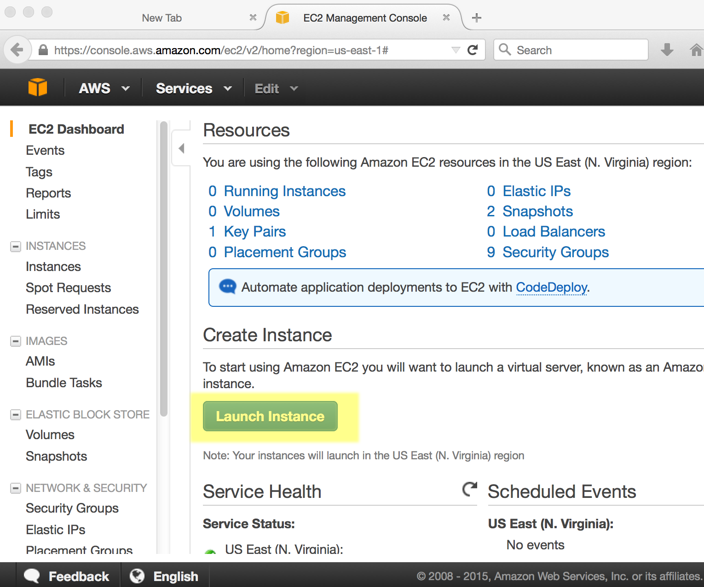
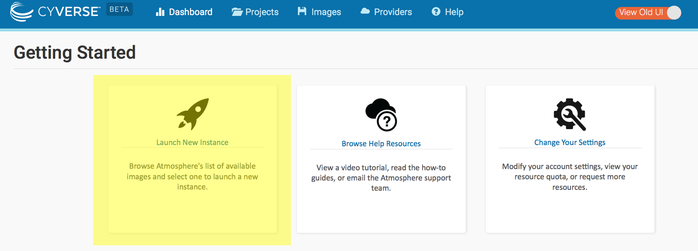
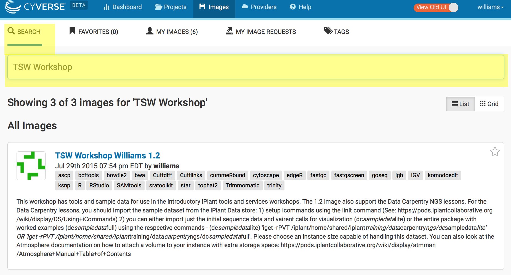
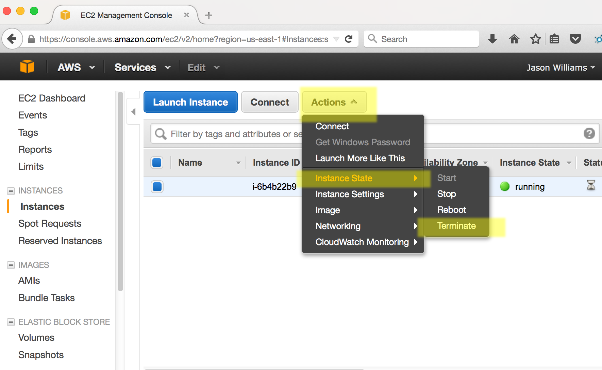

<script language="javascript" type="text/javascript">
function set_page_view_defaults() {
    document.getElementById('div_aws_win').style.display = 'block';
    document.getElementById('div_aws_unix').style.display = 'none';
    document.getElementById('div_cyverse').style.display = 'none';
    document.getElementById('div_hpc').style.display = 'none';
};

function change_content_by_platform(form_control){
    if (!form_control || document.getElementById(form_control).value == 'aws_win') {
        set_page_view_defaults();
    } else if (document.getElementById(form_control).value == 'aws_unix') {
        document.getElementById('div_aws_win').style.display = 'none';
        document.getElementById('div_aws_unix').style.display = 'block';
        document.getElementById('div_hpc').style.display = 'none';
        document.getElementById('div_cyverse').style.display = 'none';
    } else if (document.getElementById(form_control).value == 'cyverse') {
        document.getElementById('div_aws_unix').style.display = 'none';
        document.getElementById('div_cyverse').style.display = 'block';
        document.getElementById('div_hpc').style.display = 'none';
        document.getElementById('div_aws_win').style.display = 'none';
    } else if (document.getElementById(form_control).value == 'hpc') {
        document.getElementById('div_aws_unix').style.display = 'none';
        document.getElementById('div_cyverse').style.display = 'none';
        document.getElementById('div_hpc').style.display = 'block';
        document.getElementById('div_aws_win').style.display = 'none';
    } else {
        alert("Error: Missing platform value for 'change_content_by_platform()' script!");
    }
}

window.onload = set_page_view_defaults;
</script>

## Launching and logging onto a cloud instance

**Please select the platform you wish to use for the exercises: <select id="id_platform" name="platformlist" onchange="change_content_by_platform('id_platform');return false;"><option value="aws_unix" id="id_aws_unix" selected> AWS_UNIX </option><option value="aws_win" id="id_aws_win" selected> AWS_Windows </option><option value="cyverse" id="id_cyverse"> CyVerse </option><option value="hpc" id="id_hpc"> HPC/HTC cluster </option></select>**


## AWS (Amazon EC2 instances)

In this tutorial, we'll show you how to launch your own instance.

If you want to go through the the genomics lesson outside of a workshop, or if you just want to use
AWS to process your own data, you'll need to have your own account and launch your own instance.

These instructions will help you launch an instance identical to the one we use in workshops, and
and this tutorial is not meant to be exhaustive, but for minor changes:

 - You can launch any publicly available image by changing the AMI that you load in step 4 below.
 - You can choose not to load an AMI at all, and install your own software later by skipping step 4 below.
 - If you want to launch a different set of resources- more processors, more disk space, different operating system, etc;
 you can choose a different option at step 5.
 - For more detailed instructions, and how-tos for other changes consult [EC2 Getting Started](https://docs.aws.amazon.com/AWSEC2/latest/UserGuide/EC2_GetStarted.html)

### Create an AWS account

1. Go to Amazon Web Services [https://aws.amazon.com/](https://aws.amazon.com/)
2. Follow the button to sign up for an account - you will need to agree to Amazon's terms and conditions and provide credit card information.


#### Sign into AWS and Launch an Instance
1. Sign into AWS EC2 Dashboard: [https://console.aws.amazon.com/ec2/](https://console.aws.amazon.com/ec2/)
2. Ensure that you're in the Northern Virginia region.  Your current region, which is the physical location where your computer will be launched, is listed in the upper right corner of your screen next to "Support".  If something other than "N. Virginia" is listed, click on the region name to change it. Otherwise you will be unable to find the Data Carpentry image used in this lesson.
3. Click the 'Launch Instance' button
    
4. In 'Step 1' you will be asked to choose an Amazon Machine Image (AMI), on the lefthand side, look for 'Community AMIs' and then search for **ami-6516b30e**; select this image.
    
5. For 'Choose and Instance Type' select **t2.medium**; then click 'Review and Launch'
       

    > **Tip:** You can select larger instances, but these will cost more to run. Also for the 'Review Instance Launch' you will get some warning about instance security. We will not go into detail here about security groups. However, you should know that when you launch an instance, you will want to take steps to make sure no one maliciously accesses your instance. For example, never give your security credentials (next step) to another user.
6. For the 'Review Instance Launch' step, click 'Launch'
7. You will be asked to Select an existing key pair or create a new key pair. Select 'Proceed without a key pair' and select the acknowledgement you are given. Then click 'Launch Instances'
    

You instance will now be launched. You should follow the links to 'Create billing alerts' so you can easily
track your usage.


#### Connecting to your Amazon Instance

<div id="div_aws_unix" style="display:block" markdown="1">

1. Log into your AWC EC2 Dashboard [https://console.aws.amazon.com/ec2/](https://console.aws.amazon.com/ec2/)  
2. You should see that you have one instance, to proceed the instance state must be 'running' (if you just launched the instance it should take less than 5 minutes for the instance to start running)
    
3. At the bottom of the dashboard, you should see a **Public DNS** which will look something like *ec2.12.2.45.678.compute-1.amazonaws.com*. Copy that address (you may wish make a note of it as you will need this each time you connect.
    
4. Open the terminal application on your Mac and use 'ssh' to connect. Your command will be:

```
$ ssh dcuser@your.amazon.dns
```  

5. Your computer will be unable to verify the authenticity of the host... type **yes** to continue connecting  
6. Then enter the password for this computer: 'data4Carp'

You should now be connected to your personal instance. You can confirm this with the following commands; ``whoami``,``pwd``,``ls``, which should yield the following results:  

```
Last login: Thu Jul 30 13:21:08 2015 from 8.sub-70-197-200.myvzw.com  
$ whoami  
dcuser  
$ pwd  
/home/dcuser  
$ ls  
dc_sample_data	FastQC	Trimmomatic-0.32  
$  
```

</div>

<div id="div_aws_win" style="display:block" markdown="1">


0. If you haven't already, install [PuTTY](http://the.earth.li/~sgtatham/putty/latest/x86/putty.exe)<br>
1. Log into your [AWC EC2 Dashboard](https://console.aws.amazon.com/ec2/)<br>
2. You should see that you have one instance, make sure instance state is 'running' (if you just launched the instance it should take less than 5 minutes for the instance to start running)
    <br>
3. At the bottom of the dashboard, you should see a **Public DNS** which will look something like *ec2.12.2.45.678.compute-1.amazonaws.com*. Copy that address (you may wish make a note of it as you will need this each time you connect.
    <br>
4. Start PuTTY. In the section 'Specify the destination you want to connect to' for 'Host Name (or IP address)' paste in the DNS address and click 'Open'
5. When prompted to login as, enter 'dcuser'; you may be notified that the authenticity of the host cannot be verified - if so, ignore the warning an continue connecting<br>
6. When prompted for a password enter 'data4Carp'<br>

You should now be connected to your personal instance. You can confirm this with the following commands; ``whoami``,``pwd``,``ls``, which should yield the following results:

```
    Last login: Thu Jul 30 13:21:08 2015 from 8.sub-70-197-200.myvzw.com  
    $ whoami  
    dcuser  
    $ pwd  
    /home/dcuser  
    $ ls  
    dc_sample_data	FastQC	Trimmomatic-0.32  
    $  
```
<br>


</div>

<div id="div_cyverse" style="display:block" markdown="1">

## Launching an instance on Atmosphere - These instructions are in beta and not fully tested!


**Prerequisites**

* You must have a CyVerse account (register at [https://user.cyverse.org/](https://user.cyverse.org/) ) - You must also request access to Atmosphere (see [documentation](https://pods.iplantcollaborative.org/wiki/display/atmman/Requesting+Access+to+Atmosphere) **CyVerse requires Atmosphere users to have a valid .edu or .org email address** )

### Sign into Atmosphere and launch an instance
1. Sign into Atmosphere at: [https://atmo.cyverse.org/](https://atmo.cyverse.org/)

2. Under 'Select an Image', search for the 'TSW Workshop Williams 1.2' image; Select this image.
    
3. Under instance size select **'small2'** size.

    > **Tip:** You can select a larger instance, but you must have sufficient resources (no exceeded quotas). If Atmosphere is at high capacity, you may not be able to launch an instance if the instance size exceeds what is currently free on the cloud provider
5. If desired, you may name your instance; click 'Launch Instance'
    

Your instance should be ready in 10-15 minutes. When your instance status is listed as 'active' you will be able to connect.

#### Connect to Atmosphere instance

**Instructions for MAC**


1. If necessary, log into your Atmosphere at: [https://atmo.cyverse.org/](https://atmo.cyverse.org/)

2. Verifying that your instance status is **'active'**, copy the IP address (e.g. 128.123.12.34) to your clipboard.
    
3. Open the terminal application on your Mac and use 'ssh' to connect. Your command will be:

        $ ssh cyverseusername@your.atmosphere.ipaddress
    {: .bash}

5. Your computer will be unable to verify the authenticity of the host... type **yes** to continue connecting
6. When prompted for a password, enter your CyVerse username.

You should now be connected to your personal instance. You can confirm this with the following commands; ``whoami``,``pwd``, which should yield the following results:


        _   _                             _
       / \ | |_ _ __ ___   ___  ___ _ __ | |__   ___ _ __ ___
      / _ \| __| '_ ` _ \ / _ \/ __| '_ \| '_ \ / _ \ '__/ _ \
     / ___ \ |_| | | | | | (_) \__ \ |_) | | | |  __/ | |  __/
    /_/   \_\__|_| |_| |_|\___/|___/ .__/|_| |_|\___|_|  \___|
                                   |_|

    iPlant Collaborative

    The user manual is located here: http://goo.gl/2pT72

    To backup user data or volumes on a instance: https://goo.gl/hEcS59

    For assistance, contact support@iplantcollaborative.org.  

    Last login: Fri Aug 14 10:16:50 2015 from dhcp140-78.cshl.edu

    cyverseusername@vm65-164:~$ whoami
    cyverseusername
    cyverseusername@vm65-164:~$ pwd
    /home/cyverseusername
{: .bash}

**Note**: In the above example 'cyverseusername' will be your actual CyVerse username.


**Instructions for PC**

1. Download the PuTTY application at: [http://the.earth.li/~sgtatham/putty/latest/x86/putty.exe](http://the.earth.li/~sgtatham/putty/latest/x86/putty.exe)

1. If necessary, log into your Atmosphere at: [https://atmo.cyverse.org/](https://atmo.cyverse.org/)

2. Verifying that your instance status is **'active'**, copy the IP address (e.g. 128.123.12.34) to your clipboard.
    
4. Start PuTTY. In the section 'Specify the destination you want to connect to' for 'Host Name (or IP address)' paste in the DNS address and click 'Open'
5. When prompted to login as, enter your CyVerse username; you may be notified that the authenticity of the host cannot be verified - if so, ignore the warning an continue connecting
6. When prompted for a password enter your CyVerse password.

You should now be connected to your personal instance. You can confirm this with the following commands; ``whoami``,``pwd``, which should yield the following results:


        _   _                             _
       / \ | |_ _ __ ___   ___  ___ _ __ | |__   ___ _ __ ___
      / _ \| __| '_ ` _ \ / _ \/ __| '_ \| '_ \ / _ \ '__/ _ \
     / ___ \ |_| | | | | | (_) \__ \ |_) | | | |  __/ | |  __/
    /_/   \_\__|_| |_| |_|\___/|___/ .__/|_| |_|\___|_|  \___|
                                   |_|

    iPlant Collaborative

    The user manual is located here: http://goo.gl/2pT72

    To backup user data or volumes on a instance: https://goo.gl/hEcS59

    For assistance, contact support@iplantcollaborative.org.  

    Last login: Fri Aug 14 10:16:50 2015 from dhcp140-78.cshl.edu

    cyverseusername@vm65-164:~$ whoami
    cyverseusername
    cyverseusername@vm65-164:~$ pwd
    /home/cyverseusername
{: .bash}
**Note**: In the above example 'cyverseusername' will be your actual CyVerse username.


#### Bringing sample data into your Atmosphere instance

The sample dataset is **NOT** included on the Atmosphere instance. The very first time you load the instance, you will need to copy data from the public CyVerse Data Store into your instance using the following instructions.

## Setup iCommands

**Prerequisites**
* You must be connected to your Atmosphere instance

iCommands will allow you to quickly transfer data into your Atmosphere instance:

1. Initialize iCommands using the following command

        $ iinit
    {: .bash}

2. You will then be asked to setup your account and will need to enter the following information

    |Prompt|Entry|
|------|-----|
|irodsHost|data.cyverse.org|
|port|1247|
|zone|iplant|
|irodsUserName|your CyVerse username|
|Current iRODS password|your CyVerse password|

3. Verify that you have connected to your CyVerse Data Store; view the contents of your home directory using the following the ``ils`` command:

        $ ils
    {: .bash}

## Copy Sample Data to your instance

1. Enter the following command:

        $ iget -rPVT /iplant/home/shared/iplant_training/data_carpentry_ngs/dc_sampledata_lite .
    {: .bash}

2. using ``ls`` you should be able to verify you have downloaded the dc_sampledata_lite directories and files.


> **Tip**: You can use iCommands to move data between your computer, a cloud instance, and the CyVerse Data Store. iCommands is installed on the Data Carpentry Amazon AMI. You can download and see documentation for iCommands [here](https://pods.iplantcollaborative.org/wiki/display/DS/Using+iCommands)

### Terminating your Atmosphere instance

When you are finished with your instance, you must terminate. Follow the following steps.


1. If necessary, sign into Atmosphere: [https://atmo.cyverse.org/](https://atmo.cyverse.org/)

2. Under 'My Instances' select the instance you wish to terminate and the click the black 'X' or find the 'Terminate' button and click.

    > **Warning:** This will delete any data on this instance, so you must move any data you wish to save off the instance (for example by using iCommands).
5. After reading the warning and confirming you are ready, then click 'Terminate' to terminate the instance.

</div>


> ## **Very Important Warning - Avoid Unwanted Charges**
>
> Please remember, for as long as this instance is running, you will be charged for your usage. You can see an estimate of the current charge from your AWS EC2 dashboard by clicking your name (Account name) on the upper right of the dashboard and selecting 'Billing & Cost Management'.
>
> **DO NOT FORGET TO TERMINATE YOUR INSTANCE WHEN YOU ARE DONE**
{: .callout .error}


### Terminating your instance

When you are finished with your instance, you must terminate. Follow the following steps.

1. Sign into AWS and go to the EC2 Dashboard: [https://console.aws.amazon.com/ec2/](https://console.aws.amazon.com/ec2/)
2. Under 'Resources' select 'Running Instances'
3. Select the instance you wish to terminate, then click 'Actions'
    
4. Under 'Instance State' select terminate.

    > **Warning:** This will delete any data on this instance, so you must move any data you wish to save off the instance.

    >  **Tip:** You can use iCommands to move data between your computer, a cloud instance, and the CyVerse Data Store. iCommands is installed on the Data Carpentry Amazon AMI. You can download and see documentation for iCommands [here](https://pods.iplantcollaborative.org/wiki/display/DS/Using+iCommands) - there is also some documentation on setting up iCommands in the Atmosphere section below
5. Select 'Yes, Terminate' to terminate the instance.
